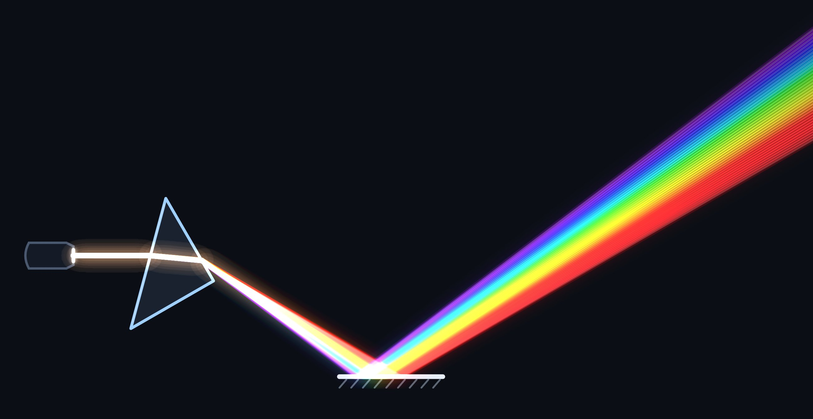
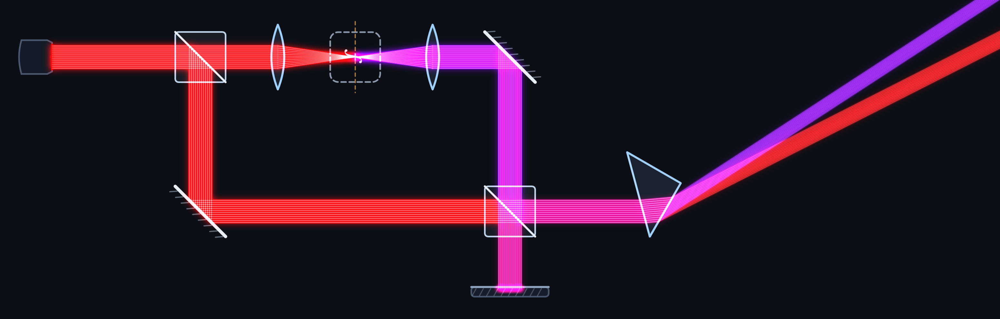
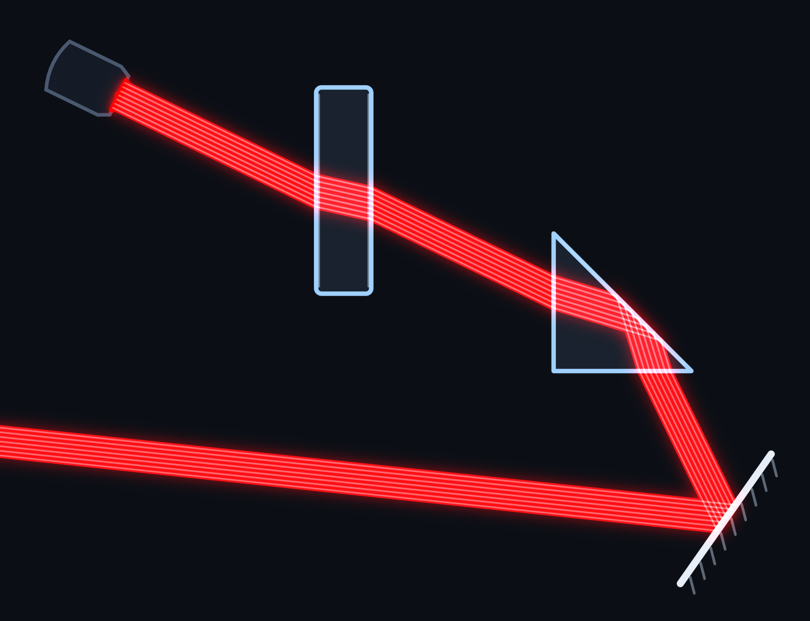

# Optical Board 光学面包板

一个在浏览器里运行的二维几何光学追迹模拟器。
拖入光学元件，实时追迹光线，搭建属于你的光学系统。

A single-file 2D geometric-optics ray-tracing playground that runs entirely in the browser. Drag in optical elements, watch the rays trace in real time, and build your own optical setup.

---
## 亮点

1. 支持一键导出透明背景图片。
2. 支持一键导出当前配置，下次直接加载即可还原。
3. 可自定义光学元件，敬请发挥想象。
4. 光源波长、宽度、亮度皆可调，还可选择白光（复合光）。

## 使用说明

1. 将右侧栏中元件拖进左侧即可放置。
2. 元件可以在块体内进行旋转、上下左右移动。
3. 支持多个元件「组合」、「复制」、「粘贴」。

---

## 元件库

激光源、反射镜、凹面镜、凸透镜、凹透镜、分束器、衍射光栅、吸收屏、玻璃、直角棱镜、狭缝光阑，二向色镜以及一个可自定义出射方式与波长变换的自定义元件。

## 内置示例

棱镜分光反射、双色场分光演示、透镜聚焦、迈克尔逊干涉、光栅分光、二路分束合束、望远镜扩束、棱镜与玻璃。点开示例场景即可一键加载。

## 使用案例
1. 光的色散

> 白光经棱镜色散，用户可自行对棱镜角度进行修改

2. 双色光的合束

> 通过自定义元件，实现倍频晶体效果

3. 玻璃折射

> 可自定义玻璃折射率，探究反射折射的奥秘

## 其它功能

明暗双主题切换、渲染精细度三档可调（搭建时流畅、导出时精细）、中英文界面一键切换、按需分辨率导出 PNG、一键隐藏元件只看光路。

---

## 本地运行

下载 `index.html`，双击用浏览器打开即可。推荐 Chrome、Edge、Safari、Firefox 等现代浏览器。

中英文界面用到的霞鹜文楷与思源黑体通过公共 CDN 加载，联网时显示效果最佳；离线打开会自动回退到系统字体，功能不受影响。

## 在线访问

可通过 `https://charm-lord.github.io/OpticalBoard/` 访问。

---

若这个小工具帮到了你，欢迎点击界面右上角的「Star」支持作者继续完善。
